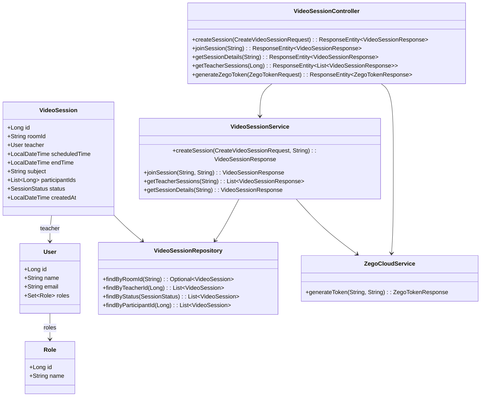

# Virtual Classroom Backend Architecture Design

## Overview
This document outlines the backend architecture for virtual classrooms in the CollegePortal Spring Boot application, integrating ZegoCloud for real-time video communication. The design supports teacher scheduling and student joining logic with proper authorization.

## Architecture Components

### 1. Entity Model: VideoSession

```java
@Entity
@Table(name = "video_sessions")
public class VideoSession {
    @Id
    @GeneratedValue(strategy = GenerationType.IDENTITY)
    private Long id;

    @Column(unique = true, nullable = false)
    private String roomId;

    @ManyToOne(fetch = FetchType.LAZY)
    @JoinColumn(name = "teacher_id", nullable = false)
    private User teacher;

    @Column(nullable = false)
    private LocalDateTime scheduledTime;

    @Column
    private LocalDateTime endTime;

    @Column
    private String subject;

    @ElementCollection
    @CollectionTable(name = "video_session_participants",
                     joinColumns = @JoinColumn(name = "video_session_id"))
    @Column(name = "participant_id")
    private List<Long> participantIds = new ArrayList<>();

    @Enumerated(EnumType.STRING)
    @Column(nullable = false)
    private SessionStatus status = SessionStatus.SCHEDULED;

    @Column(nullable = false)
    private LocalDateTime createdAt = LocalDateTime.now();

    // Getters and setters
}

public enum SessionStatus {
    SCHEDULED, ACTIVE, ENDED
}
```

**Relationships:**
- Many-to-One with User (teacher)
- Many-to-Many with User (participants) via participantIds list

### 2. Repository Interface

```java
@Repository
public interface VideoSessionRepository extends JpaRepository<VideoSession, Long> {
    Optional<VideoSession> findByRoomId(String roomId);
    List<VideoSession> findByTeacherId(Long teacherId);
    List<VideoSession> findByStatus(SessionStatus status);
    List<VideoSession> findByScheduledTimeBetween(LocalDateTime start, LocalDateTime end);
    @Query("SELECT vs FROM VideoSession vs WHERE :userId MEMBER OF vs.participantIds")
    List<VideoSession> findByParticipantId(@Param("userId") Long userId);
}
```

### 3. DTOs

#### Request DTOs

```java
public class CreateVideoSessionRequest {
    @NotBlank
    private String subject;
    @NotNull
    @Future
    private LocalDateTime scheduledTime;
    @NotNull
    @Min(30)
    @Max(480) // 8 hours max
    private Integer durationMinutes;
    // Getters and setters
}

public class JoinSessionRequest {
    @NotBlank
    private String roomId;
    // Getters and setters
}

public class ZegoTokenRequest {
    @NotBlank
    private String roomId;
    @NotBlank
    private String userId;
    // Getters and setters
}
```

#### Response DTOs

```java
public class VideoSessionResponse {
    private Long id;
    private String roomId;
    private Long teacherId;
    private String teacherName;
    private LocalDateTime scheduledTime;
    private LocalDateTime endTime;
    private String subject;
    private List<Long> participantIds;
    private SessionStatus status;
    private LocalDateTime createdAt;
    // Getters and setters
}

public class ZegoTokenResponse {
    private String token;
    private Long appId;
    // Getters and setters
}
```

### 4. Service Layer

```java
@Service
public class VideoSessionService {

    @Autowired
    private VideoSessionRepository videoSessionRepository;

    @Autowired
    private UserRepository userRepository;

    @Autowired
    private ZegoCloudService zegoCloudService;

    @Autowired
    private UserService userService;

    public VideoSessionResponse createSession(CreateVideoSessionRequest request, String teacherEmail) {
        User teacher = userRepository.findByEmail(teacherEmail)
            .orElseThrow(() -> new RuntimeException("Teacher not found"));

        if (!teacher.getRoles().stream().anyMatch(r -> r.getName().equals("FACULTY"))) {
            throw new RuntimeException("Only faculty can create sessions");
        }

        VideoSession session = new VideoSession();
        session.setRoomId(generateRoomId());
        session.setTeacher(teacher);
        session.setSubject(request.getSubject());
        session.setScheduledTime(request.getScheduledTime());
        session.setEndTime(request.getScheduledTime().plusMinutes(request.getDurationMinutes()));
        session.setStatus(SessionStatus.SCHEDULED);

        VideoSession saved = videoSessionRepository.save(session);
        return mapToResponse(saved);
    }

    public VideoSessionResponse joinSession(String roomId, String userEmail) {
        VideoSession session = videoSessionRepository.findByRoomId(roomId)
            .orElseThrow(() -> new RuntimeException("Session not found"));

        User user = userRepository.findByEmail(userEmail)
            .orElseThrow(() -> new RuntimeException("User not found"));

        if (!session.getParticipantIds().contains(user.getId())) {
            session.getParticipantIds().add(user.getId());
            videoSessionRepository.save(session);
        }

        // Activate session if scheduled time reached
        if (session.getStatus() == SessionStatus.SCHEDULED &&
            LocalDateTime.now().isAfter(session.getScheduledTime())) {
            session.setStatus(SessionStatus.ACTIVE);
            videoSessionRepository.save(session);
        }

        return mapToResponse(session);
    }

    public List<VideoSessionResponse> getTeacherSessions(String teacherEmail) {
        User teacher = userRepository.findByEmail(teacherEmail)
            .orElseThrow(() -> new RuntimeException("Teacher not found"));

        List<VideoSession> sessions = videoSessionRepository.findByTeacherId(teacher.getId());
        return sessions.stream().map(this::mapToResponse).collect(Collectors.toList());
    }

    public VideoSessionResponse getSessionDetails(String roomId) {
        VideoSession session = videoSessionRepository.findByRoomId(roomId)
            .orElseThrow(() -> new RuntimeException("Session not found"));
        return mapToResponse(session);
    }

    private String generateRoomId() {
        return "room_" + UUID.randomUUID().toString().substring(0, 8);
    }

    private VideoSessionResponse mapToResponse(VideoSession session) {
        VideoSessionResponse response = new VideoSessionResponse();
        // mapping logic
        return response;
    }
}

@Service
public class ZegoCloudService {

    @Value("${zego.app.id}")
    private Long appId;

    @Value("${zego.server.secret}")
    private String serverSecret;

    public ZegoTokenResponse generateToken(String roomId, String userId) {
        // ZegoCloud token generation logic using JWT
        // Implementation based on ZegoCloud documentation
        String token = generateZegoToken(appId, serverSecret, roomId, userId);

        ZegoTokenResponse response = new ZegoTokenResponse();
        response.setToken(token);
        response.setAppId(appId);
        return response;
    }

    private String generateZegoToken(Long appId, String serverSecret, String roomId, String userId) {
        // JWT token generation with ZegoCloud specific claims
        // Include app_id, user_id, room_id, privilege, expire_time
        // Use io.jsonwebtoken library
        return Jwts.builder()
            .setHeaderParam("alg", "HS256")
            .setHeaderParam("typ", "JWT")
            .claim("app_id", appId)
            .claim("user_id", userId)
            .claim("room_id", roomId)
            .claim("privilege", Map.of("1", 1, "2", 1)) // publish and play privileges
            .claim("expire_time", System.currentTimeMillis() / 1000 + 3600) // 1 hour
            .signWith(SignatureAlgorithm.HS256, serverSecret.getBytes())
            .compact();
    }
}
```

### 5. Controller

```java
@RestController
@RequestMapping("/api/video-sessions")
public class VideoSessionController {

    @Autowired
    private VideoSessionService videoSessionService;

    @Autowired
    private ZegoCloudService zegoCloudService;

    @PostMapping
    @PreAuthorize("hasRole('FACULTY')")
    public ResponseEntity<VideoSessionResponse> createSession(@Valid @RequestBody CreateVideoSessionRequest request) {
        String teacherEmail = getCurrentUserEmail();
        VideoSessionResponse response = videoSessionService.createSession(request, teacherEmail);
        return ResponseEntity.status(HttpStatus.CREATED).body(response);
    }

    @PostMapping("/{roomId}/join")
    @PreAuthorize("hasRole('STUDENT') or hasRole('FACULTY')")
    public ResponseEntity<VideoSessionResponse> joinSession(@PathVariable String roomId) {
        String userEmail = getCurrentUserEmail();
        VideoSessionResponse response = videoSessionService.joinSession(roomId, userEmail);
        return ResponseEntity.ok(response);
    }

    @GetMapping("/{roomId}")
    @PreAuthorize("hasRole('STUDENT') or hasRole('FACULTY')")
    public ResponseEntity<VideoSessionResponse> getSessionDetails(@PathVariable String roomId) {
        VideoSessionResponse response = videoSessionService.getSessionDetails(roomId);
        return ResponseEntity.ok(response);
    }

    @GetMapping("/teacher/{teacherId}")
    @PreAuthorize("hasRole('FACULTY') and #teacherId == authentication.principal.id or hasRole('ADMIN')")
    public ResponseEntity<List<VideoSessionResponse>> getTeacherSessions(@PathVariable Long teacherId) {
        // For simplicity, get current user's sessions
        String teacherEmail = getCurrentUserEmail();
        List<VideoSessionResponse> responses = videoSessionService.getTeacherSessions(teacherEmail);
        return ResponseEntity.ok(responses);
    }

    @PostMapping("/zego/token")
    @PreAuthorize("hasRole('STUDENT') or hasRole('FACULTY')")
    public ResponseEntity<ZegoTokenResponse> generateZegoToken(@Valid @RequestBody ZegoTokenRequest request) {
        String userId = getCurrentUserId().toString();
        ZegoTokenResponse response = zegoCloudService.generateToken(request.getRoomId(), userId);
        return ResponseEntity.ok(response);
    }

    private String getCurrentUserEmail() {
        Authentication auth = SecurityContextHolder.getContext().getAuthentication();
        return auth.getName();
    }

    private Long getCurrentUserId() {
        String email = getCurrentUserEmail();
        User user = userRepository.findByEmail(email).orElseThrow();
        return user.getId();
    }
}
```

### 6. Database Migration

```sql
-- V4__Create_video_sessions_table.sql
CREATE TABLE video_sessions (
    id BIGINT AUTO_INCREMENT PRIMARY KEY,
    room_id VARCHAR(255) NOT NULL UNIQUE,
    teacher_id BIGINT NOT NULL,
    scheduled_time TIMESTAMP NOT NULL,
    end_time TIMESTAMP,
    subject VARCHAR(255),
    status VARCHAR(50) NOT NULL DEFAULT 'SCHEDULED',
    created_at TIMESTAMP NOT NULL DEFAULT CURRENT_TIMESTAMP,
    FOREIGN KEY (teacher_id) REFERENCES users(id)
);

CREATE TABLE video_session_participants (
    video_session_id BIGINT NOT NULL,
    participant_id BIGINT NOT NULL,
    PRIMARY KEY (video_session_id, participant_id),
    FOREIGN KEY (video_session_id) REFERENCES video_sessions(id),
    FOREIGN KEY (participant_id) REFERENCES users(id)
);
```

### 7. Configuration

Add to `application.properties`:
```
zego.app.id=your_app_id
zego.server.secret=your_server_secret
```

Add dependency to `pom.xml`:
```xml
<dependency>
    <groupId>io.jsonwebtoken</groupId>
    <artifactId>jjwt-api</artifactId>
    <version>0.12.6</version>
</dependency>
<dependency>
    <groupId>io.jsonwebtoken</groupId>
    <artifactId>jjwt-impl</artifactId>
    <version>0.12.6</version>
    <scope>runtime</scope>
</dependency>
```

## Class Diagram



## API Specifications

### POST /api/video-sessions
- **Authorization:** FACULTY role
- **Request Body:**
```json
{
  "subject": "Mathematics 101",
  "scheduledTime": "2024-01-15T10:00:00",
  "durationMinutes": 60
}
```
- **Response:** VideoSessionResponse (201 Created)

### POST /api/video-sessions/{roomId}/join
- **Authorization:** STUDENT or FACULTY role
- **Response:** VideoSessionResponse (200 OK)

### GET /api/video-sessions/{roomId}
- **Authorization:** STUDENT or FACULTY role
- **Response:** VideoSessionResponse (200 OK)

### GET /api/video-sessions/teacher/{teacherId}
- **Authorization:** FACULTY (own sessions) or ADMIN
- **Response:** List<VideoSessionResponse> (200 OK)

### POST /api/zego/token
- **Authorization:** STUDENT or FACULTY role
- **Request Body:**
```json
{
  "roomId": "room_12345678",
  "userId": "user_123"
}
```
- **Response:**
```json
{
  "token": "jwt_token_here",
  "appId": 123456789
}
```

## Integration Points

### Existing User/Role System
- **Authorization:** Uses Spring Security with @PreAuthorize annotations
- **Roles:** FACULTY for teachers, STUDENT for participants, ADMIN for management
- **Authentication:** JWT-based, extracts user email from token for user lookup

### Existing Codebase Patterns
- **DTO Pattern:** Request/Response DTOs for API contracts
- **Service Layer:** Business logic separated from controllers
- **Repository Pattern:** JPA repositories for data access
- **Exception Handling:** Global exception handler for consistent error responses
- **Validation:** Bean validation on request DTOs

### Security Considerations
- Room IDs are unique and generated server-side
- Token generation requires valid session participation
- Authorization checks ensure teachers can only manage their sessions
- Students can only join sessions they have access to

### Scalability Considerations
- Participant list stored as simple list; for large sessions, consider separate table with pagination
- Session status updates could trigger WebSocket notifications (future enhancement)
- Token caching could reduce ZegoCloud API calls

This architecture provides a solid foundation for virtual classrooms with proper authorization, session management, and ZegoCloud integration.